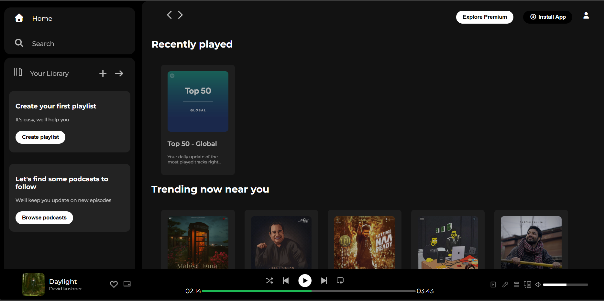

# Spotify-Clone
🎵 A visually stunning and pixel-perfect recreation of Spotify’s web interface — built entirely with HTML &amp; CSS. Experience a modern, responsive dark UI crafted with pure design magic — no JavaScript, just clean code, elegant layout, and pure CSS creativity.

---

---

## 🌟 Overview

This project is a pure CSS front-end clone of Spotify’s web player, created to demonstrate the power of design and layout achievable with just HTML and CSS.  
It features a modern, fully responsive UI including sidebar navigation, a main content section, and a bottom music player — all styled to match Spotify’s sleek dark aesthetic.

---

## ✨ Features

- 🎨 Pixel-perfect Spotify-like UI
- 💻 Pure HTML & CSS — no JS or frameworks  
- 📱 Fully responsive — works across desktop, tablet & mobile  
- 🖤 Modern dark mode design with smooth layout  
- ⚡ Lightweight and fast-loading
- 🎶 Realistic music player section (controls, progress, volume)  
- 💼 Perfect for portfolios, CSS practice & UI design showcases

---

## 🧩 Tech Stack

| Technology | Purpose |
|-------------|----------|
| HTML | Structure of the page |
| CSS3 (Flexbox + Grid) | Styling & responsive layout |
| Google Fonts (Montserrat, Poppins) | Typography |
| Font Awesome | Icons for UI elements |

---

## 📂 Folder Structure

Spotify-Clone/
│
├── index.html # Main HTML file
├── style.css # CSS styles
├── assets/ # Images & icons used in the design
└── Screenshot.png # Preview of the project
